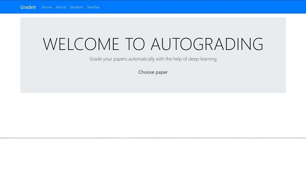
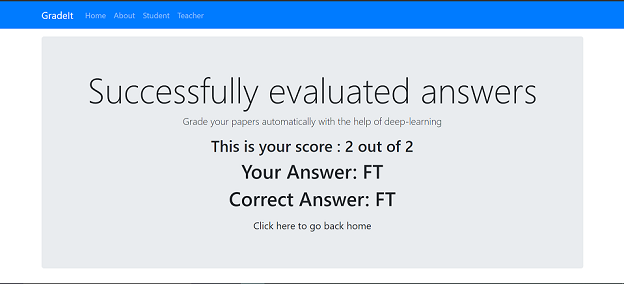

# AdvancedTrack
Project under Piyush Rai to auto grade answer scripts. Uses
 - **OpenCV** to preprocess images
 - **TensorFlow** to train the Deep Learning model
 - **MERN Stack** to act as the interface to upload answer sheets.
 
## Requirements
python>=2.7

npm>=6

## OpenCV
We first process the images before sending them into our ML model. We smoothen the image using *Gaussian Blur* to remove noise so that our *Sobel Operators* can detect edges well. Used *Canny Edge Detection* to identify the bounding boxes around the written text. 

<em>Processed Handwritten T</em>

<em>Processed Handwritten F</em>

## TensorFlow
We used *adam* as our optimizer to train our deep learning model. We used a sparse categorical cross-entropy loss function since our classes were mutually exclusive. We used the EMNIST Dataset to train our models, (including some local samples) to train our model and were able to achieve an accuracy of upto *98%*

*Training of the model*

## HandleBars and Express
In order to serve as an interface to upload answer sheets as well as view marks, we created a website using nodejs. We used express to handle our routes for the server and Express Handlebars as a templating engine.

<em>Home Page</em>

<em>Results Page</em>

